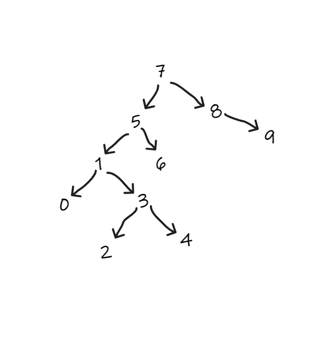

# Binary Search Tree Projesi
## [7, 5, 1, 8, 3, 6, 0, 9, 4, 2] dizisinin Binary-Search-Tree aşamalarını yazınız.

       1. Aşama = 7 kök (root) olarak atadık
       2. Aşama = sıradaki sayımız 5 ve  5'i eklemek için 7 ye sorduk senden büyük mü küçük mü diye ? küçük dediği için sol tarafa ekledik
       3. Aşama = sıradaki sayımız 1 ve 1'i eklemek için yediye soruyoruz senden büyükmü küçükmü diye ? küçük der sola gideriz ve önümüze 5 çıkar aynı          soruyu sorarız küçük olduğumuz için sola geçer yerimizi alırız
       4. Aşama = sıradaki sayımız 8 ve 8'i eklemek için 7 ye sorarız ve cevabı büyük olduğu için sağ tarafa ekleriz
       5.  Velhasıl kelam mantık böyle devam eder

